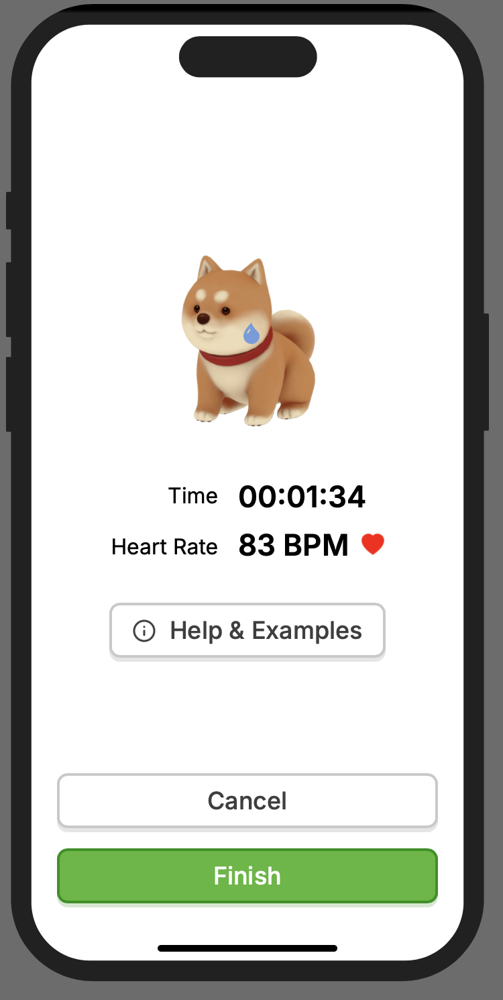

# FitBuddy-prototype
This repository contains the code of an interactive prototype for FitBuddy—a mobile fitness app focusing on motivating users and gamification elements.

# Screenshots

# Credits
"Shiba" (https://skfb.ly/6WxVW) by zixisun02 is licensed under Creative Commons Attribution (http://creativecommons.org/licenses/by/4.0/).

"Dinosaur" (https://skfb.ly/6YnPP) by zixisun02 is licensed under Creative Commons Attribution (http://creativecommons.org/licenses/by/4.0/).

"Room (Maru)" (https://skfb.ly/6TZq8) by RitaMirgo is licensed under Creative Commons Attribution (http://creativecommons.org/licenses/by/4.0/).

"Low Poly Nature" (https://skfb.ly/6CvOW) by EdwiixGG is licensed under Creative Commons Attribution (http://creativecommons.org/licenses/by/4.0/).
